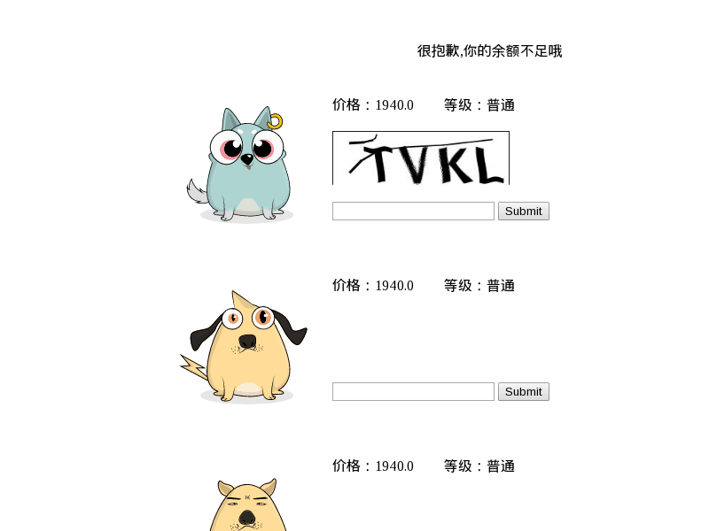

### 百度莱茨狗购买脚本

支持属性选择，初始金额，初始等级，稀有数

>

### web版本效果

>

### 配置
配置根目录下config.json

    num_of_rare_attr    稀有属性个数
    max_num_of_pages    最大页数
    body                体型
    eyes                眼睛
    mouth               嘴巴
    pattern             花纹
    color_of_body       体型颜色
    color_of_eyes       眼睛颜色
    color_of_pattern    花纹颜色
    color_of_belly      肚皮颜色
    sort_by             按照rare/price排序
    initial_degree      初始等级
    initial_amount      初始金额

>

### 说明

使用前请安装pillow,flask
    
    pip2 install flask
    pip2 install pillow

1.编辑config.ini  
    
    [Pet-Chain]
    interval    程序间隔
    common      普通品质价格
    rare        稀有品质价格
    excellence  卓越品质价格
    epic        史诗品质价格
    mythical    神话品质价格
    webdriver   firefox/chrome

    [Login]
    username    百度用户名
    password    百度密码  

2.如果不使用selenium，则需要保存headers  
打开[莱茨狗市场页面](https://pet-chain.baidu.com/chain/dogMarket?t=1517819157016)，登录  
打开浏览器调试模式，点击价格排序，并将*queryPetsOnSale*请求的headers复制到*data/headers.txt*中  

只有实时价格小于设置的价格，才会尝试购买  

>

### 用法

    # 直接运行
    python2 pet_chain.py run
    
    # 网页版 
    python2 web.py
    在浏览器中打开： http://127.0.0.1:5000/ 
>
### 最后

欢迎加入微信群、QQ群一起讨论  

